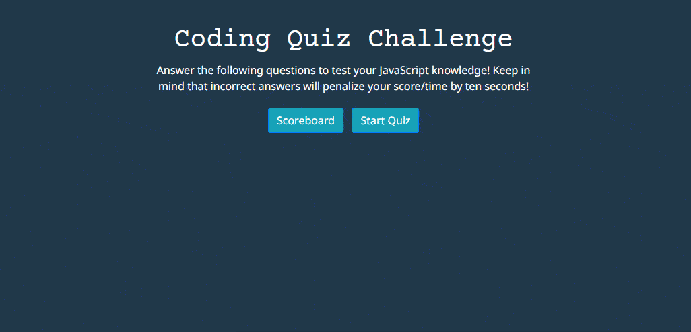

# Code Quiz

## About the Project
Test your JavaScript knowledge with this interactive quiz! 
### Features
* Timer and score
* Choice of correct and incorrect answers
* Local storage for scoreboard display
* Multiple quiz attempts

### Built With
[![Bootstrap][Bootstrap.com]][Bootstrap-url]
[![JQuery][JQuery.com]][JQuery-url]

## Geting Started
1. Visit [this page](https://awoelf.github.io/unit2-challenge/) to view the webpage in your browser.
2. Click the `Start Quiz` button to begin the quiz or click the `Scoreboard` button to view scores.
3. Answer the questions until reaching the end screen.
4. Click the Enter your initials and click the `Submit Score` button to log your score into the scoreboard
5. Click the `Reset Quiz` button to try again! 

### Prerequisite
Install a modern internet browser and connect to the internet.

## License
Distributed unter the MIT license. See `LICENSE.txt` for more information

## Contact
Alexis Woelffer - [awoelf@outlook.com](mailto:awoelf@outlook.com)

[![LinkedIn][linkedin-shield]][linkedin-url]

<!-- Links and images -->
[linkedin-shield]: https://img.shields.io/badge/-LinkedIn-black.svg?style=for-the-badge&logo=linkedin&colorB=555
[linkedin-url]: https://linkedin.com/in/alexis-w-dev
[Bootstrap.com]: https://img.shields.io/badge/Bootstrap-563D7C?style=for-the-badge&logo=bootstrap&logoColor=white
[Bootstrap-url]: https://getbootstrap.com
[JQuery.com]: https://img.shields.io/badge/jQuery-0769AD?style=for-the-badge&logo=jquery&logoColor=white
[JQuery-url]: https://jquery.com 

(<a href="#readme-top">back to top</a>)
